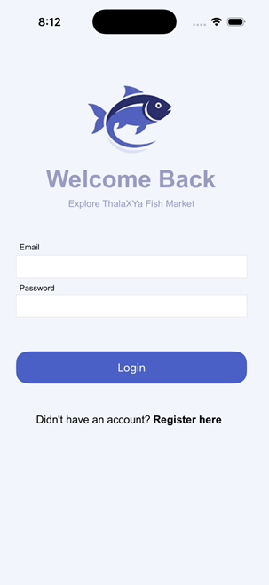
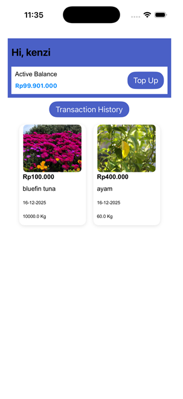
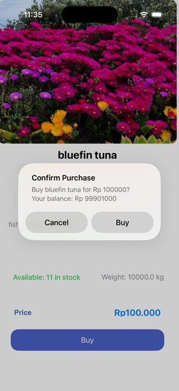
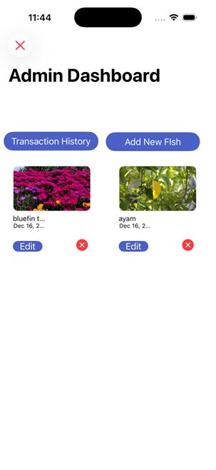
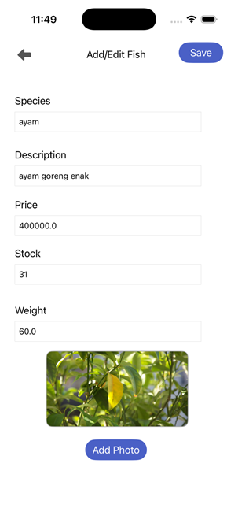
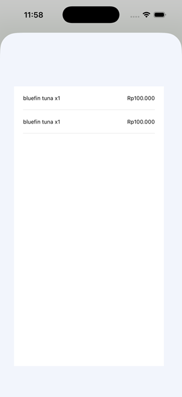

<div align="center">
  
</div>

# ThalaXYa 🐟

A seamless fish market management iOS application built natively using Swift and Core Data. 

*This is a collaborative group project developed to fulfill the requirements for the **MOBI6009001 - LAB** course at **Binus University**.*

---

## 📖 About the Project
ThalaXYa aims to digitize and simplify fish market operations. We wanted to build a practical tool that serves both sides of the market: the **Administrators** who manage the inventory, and the **Buyers** who browse and purchase the fish. From user authentication to tracking the flow of transactions, ThalaXYa handles the entire lifecycle locally using Core Data.

## ✨ Key Features
- **Account System:** Secure registration and login mechanism.
- **Role-Based Access:** 
  - **Admins:** Have full control over the inventory. They can add new fish, update details, and delete old stock.
  - **Buyers:** Can browse available fish, view details, and make purchases.
- **Digital Wallet:** Users can easily top-up their balance to keep buying fish without friction.
- **Transaction History:** A dedicated dashboard to track who bought what, and when.
- **Native UI:** Clean, responsive table views built entirely with UIKit for a smooth iOS experience.

## 🛠️ Tech Stack
- **Language:** Swift 5
- **Framework:** UIKit
- **Database:** Core Data (Local persistence)
- **Architecture:** MVC (Model-View-Controller)
- **Target:** iOS 14.0+

## 📱 App Walkthrough
Here's a quick look at the app in action:

### Authentication & User View
| Login | User Dashboard | Buying Fish |
|-------|----------------|-------------|
|  |  |  |

### Admin View & Transactions
| Admin Dashboard | Manage Inventory | Transactions History |
|-----------------|------------------|----------------------|
|  |  |  |

---

## 🚀 Getting Started
There are no external dependencies or CocoaPods required. The project relies entirely on native frameworks.

1. **Clone the repository:**
   ```bash
   git clone https://github.com/ghtmarco/ThalaXYa.git
   ```
2. **Open the project:**
   Navigate to the folder and open `ThalaXYa.xcodeproj` in Xcode.
3. **Build and Run:**
   Hit `Cmd + R` to build and run it on your preferred iOS simulator.

*Note: Requires Xcode 12+ and iOS 14+.*

## 📄 License
This project is licensed under the MIT License.